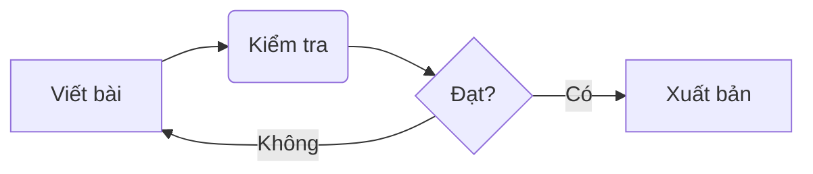

Bài viết này sẽ hướng dẫn bạn cách tận dụng tối đa các tính năng của theme Chirpy để tạo ra những nội dung chất lượng và chuyên nghiệp.

## 1. Đặt tên và Đường dẫn
Mọi bài viết phải được đặt trong thư mục `_posts`{: .filepath } với định dạng tên tệp:
`YYYY-MM-DD-TITLE.EXTENSION`{: .filepath }

> Ví dụ: `2026-03-03-huong-dan-viet-bai.md`{: .filepath }
{: .prompt-tip }

## 2. Front Matter
Đây là phần khai báo thông số ở đầu mỗi bài viết. Một cấu trúc cơ bản thường như sau:

```yaml
---
title: "Tiêu đề bài viết"
date: 2026-03-03 15:00:00 +0700
categories: [Cấp 1, Cấp 2] # Tối đa 2 cấp
tags: [the1, the2]         # Nên viết thường
pin: true                  # Ghim bài viết lên đầu trang chủ
math: true                 # Bật hỗ trợ công thức toán học
mermaid: true              # Bật hỗ trợ sơ đồ Mermaid
---
```

## 3. Quản lý Media (Ảnh & Video)

### Hình ảnh nâng cao
Chirpy hỗ trợ rất nhiều thuộc tính cho hình ảnh:

- **Chú thích và Kích thước:**
  {: w="32" h="32" }
  _Chú thích ảnh hiển thị ở đây_

- **Chế độ Sáng/Tối:**
  Bạn có thể chỉ định ảnh nào hiện ở chế độ nào:
  ```markdown
  {: .light }
  {: .dark }
  ```

- **Vị trí và Đổ bóng:**
  Sử dụng `{: .left }`, `{: .right }` hoặc `{: .shadow }`.

### Nhúng Video & Audio
Sử dụng mã `include` để nhúng nội dung từ các nền tảng xã hội:

- **YouTube:** ``
- **Twitch:** ``
- **Spotify:** ``

## 4. Các khối nội dung đặc biệt

### Prompts (Thông báo)
Có 4 loại: `tip`, `info`, `warning`, `danger`.

> **Thông tin quan trọng:** Hãy luôn kiểm tra ngày tháng trong Front Matter nếu bài viết không hiển thị.
{: .prompt-info }

### Mã nguồn (Code)
Bạn có thể hiển thị tên file trên khối code:

```bash
bundle exec jekyll serve
```
{: file="terminal" }

## 5. Toán học & Sơ đồ

**Toán học (MathJax):**
$$
E = mc^2
$$

**Sơ đồ (Mermaid):**


---

Để tìm hiểu sâu hơn, bạn có thể tham khảo tệp `_config.yml`{: .filepath } để cấu hình các tính năng toàn cục như Comment hay Analytics.
