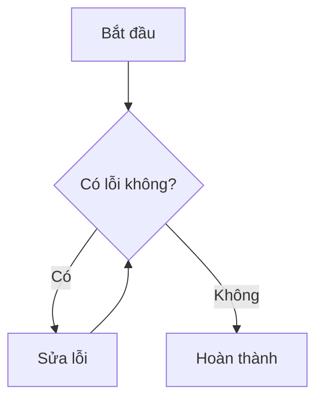

Bài viết này trình bày tất cả các tính năng định dạng văn bản và đa phương tiện mà theme Chirpy hỗ trợ.

## Headings (Tiêu đề)
Sử dụng các thẻ `#` để tạo tiêu đề từ H1 đến H4.

### Heading 3
#### Heading 4

## Paragraph (Đoạn văn)
Đây là một đoạn văn bản bình thường. Bạn có thể viết nội dung dài ở đây để kiểm tra khả năng hiển thị của font chữ.

## Lists (Danh sách)

### Ordered list (Có thứ tự)
1. Mục thứ nhất
2. Mục thứ hai
3. Mục thứ ba

### Unordered list (Không thứ tự)
- Ý chính một
- Ý chính hai
  - Ý phụ hai chấm một

### ToDo list (Danh sách công việc)
- [x] Đã hoàn thành công việc A
- [ ] Đang thực hiện công việc B
- [ ] Chưa bắt đầu công việc C

### Description list (Danh sách mô tả)
Thuật ngữ Jekyll
: Một công cụ tạo trang web tĩnh (SSG) mạnh mẽ.

Thuật ngữ Chirpy
: Một giao diện hiện đại dành cho Jekyll.

## Block Quote (Trích dẫn)
> "Kiến thức là sức mạnh, nhưng chia sẻ kiến thức mới là nguồn gốc của sự phát triển."
>
> --- *Người ẩn danh*

## Prompts (Khối thông báo)

> Đây là một mẹo nhỏ hữu ích (Tip).
{: .prompt-tip }

> Đây là thông tin quan trọng cần lưu ý (Info).
{: .prompt-info }

> Cảnh báo quan trọng dành cho bạn (Warning).
{: .prompt-warning }

> Nguy hiểm! Hành động này có thể gây lỗi (Danger).
{: .prompt-danger }

## Tables (Bảng)

| Tên | Công nghệ | Đánh giá |
| :--- | :---: | :--- |
| Jekyll | Ruby | Ổn định |
| Hugo | Go | Nhanh |
| Astro | JS | Hiện đại |

## Links (Liên kết)
Truy cập [Google](https://google.com) hoặc xem mã nguồn của chúng ta tại `_config.yml`{: .filepath }.

## Footnote (Chú thích)
Đây là một ví dụ về chú thích[^1]. Bạn có thể nhấn vào số để xuống cuối trang xem giải thích và nhấn nút quay lại để lên đây (Reverse Footnote).

## Code (Mã nguồn)

### Inline code
Sử dụng `npm install` để cài đặt.

### Filepath
Đường dẫn tệp tin: `assets/css/main.scss`{: .filepath }.

### Code blocks
```javascript
function helloWorld() {
  console.log("Chào mừng bạn đến với Jekyll Chirpy!");
}
```

## Mathematics (Toán học)
Khi viết công thức toán, hãy bật `math: true` ở phần đầu trang (Front Matter).

Ví dụ công thức Pythagoras:
$a^2 + b^2 = c^2$

Công thức phức tạp hơn:
$$
\sum_{i=1}^{n} i = \frac{n(n+1)}{2}
$$

## Mermaid SVG (Sơ đồ)
Hãy bật `mermaid: true` ở Front Matter.



## Images (Hình ảnh)
Chèn ảnh với kích thước tùy chỉnh và chú thích:

{: width="32" height="32" }
_Đây là chú thích bên dưới hình ảnh_

> Bạn cũng có thể căn lề cho ảnh bằng `{: .left }`, `{: .right }` hoặc `{: .shadow }`.
{: .prompt-info }

## Video (Video YouTube)
Sử dụng mã `id` của video YouTube:



---

[^1]: Đây là nội dung của chú thích ở cuối trang.
